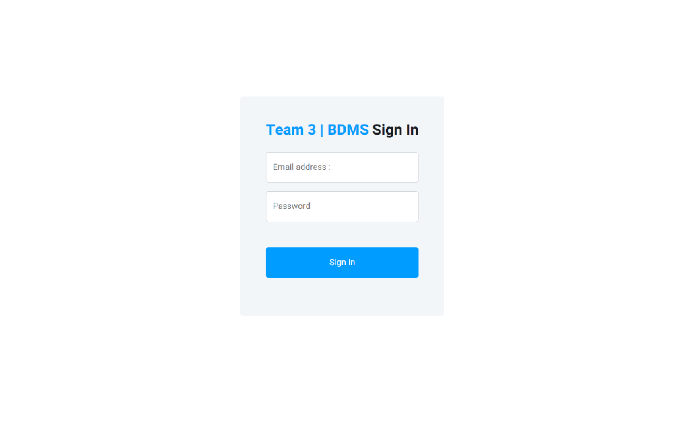
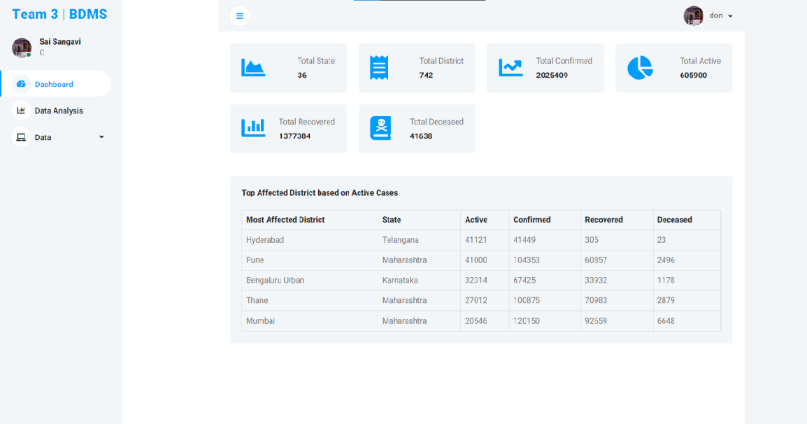
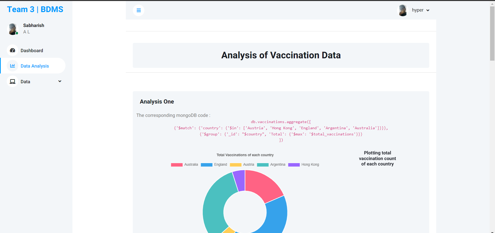
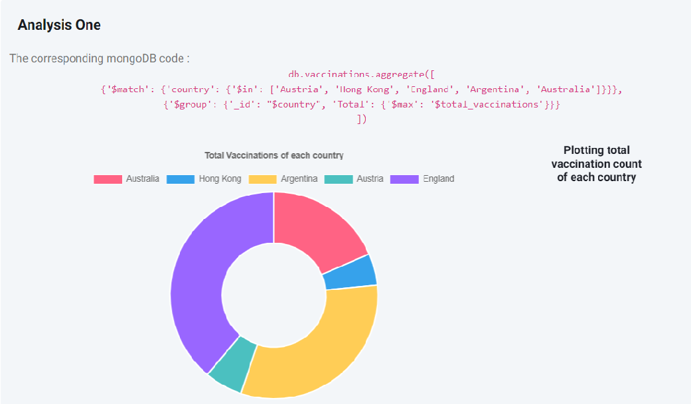
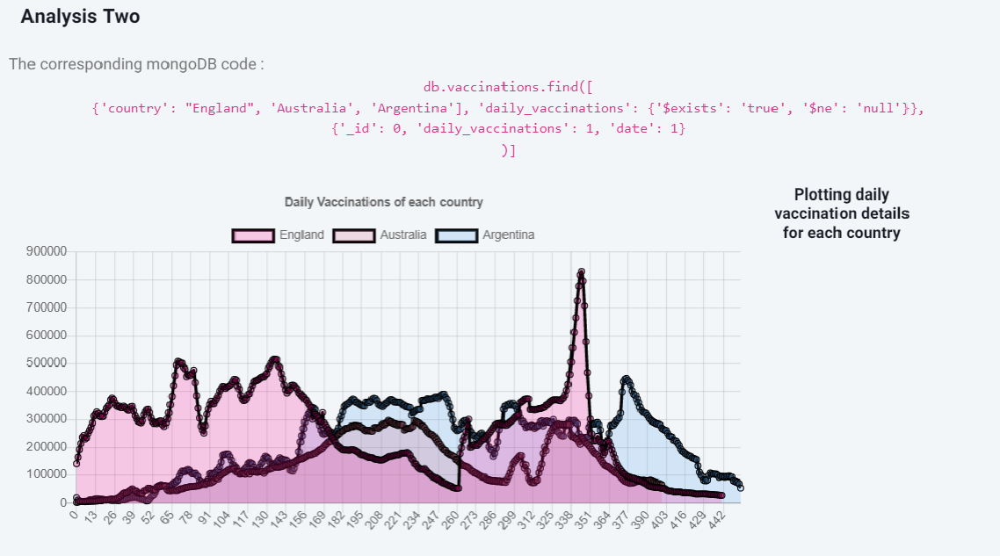

 

<h1><b>19AIE304 - BDMS END SEM PROJECT  Team - 03</b></h1>
   
 

# <b>Team Members :</b>

<table>
  <tr>
    <th>Name :</th>
    <th>Roll No :</th>
  </tr>
  <tr>
    <td> Haripranav J M</td>
    <td>CB.EN.U4AIE20021</td>
  </tr>
  <tr>
    <td>Pravin Raj A K</td>
    <td> CB.EN.U4AIE20054</td>
  </tr>
    <tr>
    <td>Sabharish A L</td>
    <td>CB.EN.U4AIE20061</td>
  </tr>
    <tr>
    <td>Sai Sangavi C</td>
    <td>CB.EN.U4AIE20063</td>
  </tr>
    <tr>
    <td>Saivarsha R </td>
    <td>CB.EN.U4AIE20064</td>
  </tr>
</table>
 

# <b>Project Title : </b>
## Covid-19 Vaccination and Cases Analysis Along with 
## &emsp;&emsp;-> 3 Tier Architecture
## &emsp;&emsp;-> Data Replication [ CAP Theorem ]
## &emsp;&emsp;-> Data Streaming

 

# <b>File Contents :</b>

* > **Server** directory containing codes for the application server 
* > *data/country_vaccinations.csv* -> Dataset of global vaccination report  
* > *data/district_level_latest.csv* -> Dataset of Indian District vise Covid Cases
* > *`dataInsertion.py`* ->   Code for inserting data into the mongoDB database server
* > *`dataAnalysis.py`* &ensp;-> Code performing some analysis from the database

 

# <b>Instructions :</b>

> * For creating a _**mongodb**_ database with replication enabled, In the terminal type :   
&emsp; `mongod --dbpath <path_to_db_storage> --replSet <replication_set_name> --bind_ip <your_system_ip> `    
The same command can be given to all the different nodes provided they are in the same network

> * Next in the primary node open a terminal and then type    
&emsp;`mongosh --host <your_system_ip>`   
Then in the mongosh shell to initiate the replication set and add the nodes   &emsp;`rs.initiate()` &emsp;`rs.add(<node1_ip>:<port>)` &emsp;`rs.add(<node2_ip>:<port>)`   
You can check the status of the database using    &emsp; `rs.status()`

> * Now we can have the mongoDB url for connecting through a application
  &emsp;`mongodb://<node1_ip>:<node1_port>,<node2_ip>:<node2_port>,<node3_ip>:<node3_port>/?directConnection=true&serverSelectionTimeoutMS=2000&appName=mongosh+1.6.0`    
Once you get the URL make sure you also change it in the _**Server/mongoDB/views.py**_ `connString` variable

 

# <b> Applciation Server : </b>

The application server is developed using Python's Django Framework.  
To start the server run the following command in the terminal at the **Server** directory:  
> `python manage.py runserver`  

To access the application server in the network run the following command in the terminal at the same directory  
> `python manage.py runserver 0.0.0.0:<port>`    [or]  
`python manage.py runserver <system_ip>:<port>`

To create a new admin account to access the server run the following command: 
> `python manage.py createsuperuser`  

and fill the asked details and then make sure you enter the same in the admin dashboard and the datainsertion code    
Sample username and password :  
<b>User Name : </b> admin  
<b>Password : </b> admin
 
 

# <b>Images : </b>

## Analysis Images

  

